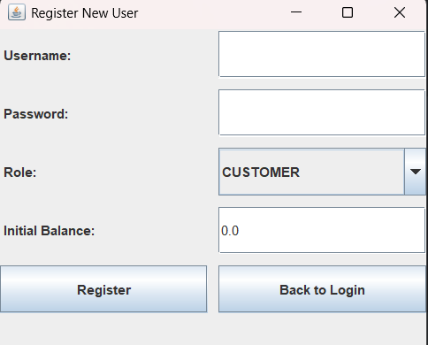

# 🛒 Java Store Management System

A comprehensive desktop-based Online Store application built using **Java** and **Swing (GUI)**. This project demonstrates Object-Oriented Programming (OOP) principles, file management (or data structures), and user interface design.

The system features a dual-role authentication mechanism allowing both **Admins** and **Customers** to interact with the store differently.

## ✨ Features

### 🔐 User Authentication
- **Login System:** Secure login for existing users.
- **Registration:** New users can sign up, select their role (Customer), and set an initial balance.

### 👤 Customer Panel
- **Browse Products:** View a list of available products with details (Name, Category, Price, Stock).
- **Search & Sort:** Filter products by name or sort them by ID/Price.
- **Shopping Cart:** Add items to the cart, view the total price, and remove items before finalizing.
- **Wallet System:** View current balance and add funds to the wallet.
- **Checkout:** Finalize purchases (updates stock and deducts user balance).

### 🛠 Admin Panel
- **Inventory Management:** View all products in the database.
- **Product Operations:**
  - Add new products.
  - Edit or restock existing items.
  - Remove items from the store.
- **Order Processing:** Handle customer orders (process/verify).

## 📸 Pictures

### 1. Login & Registration
*Entry point of the application allowing users to sign in or create a new account.*




### 2. Admin Dashboard
*The control panel for store managers to handle inventory and stock.*


### 3. Customer Dashboard
*The shopping interface where users can browse items and manage their balance.*


### 4. Shopping Cart & Checkout
*Users can review their selected items and proceed to payment.*


## 🚀 How to Run

1. **Clone the repository:**
```bash
   git clone https://github.com/shahryarkhatib8-commits/Ap40013306Project.git
   
